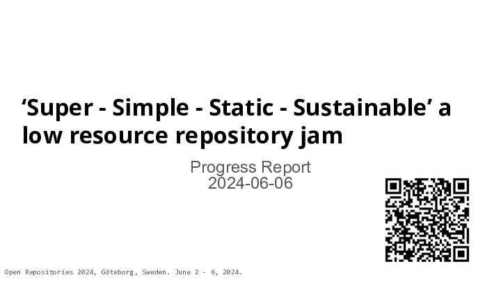
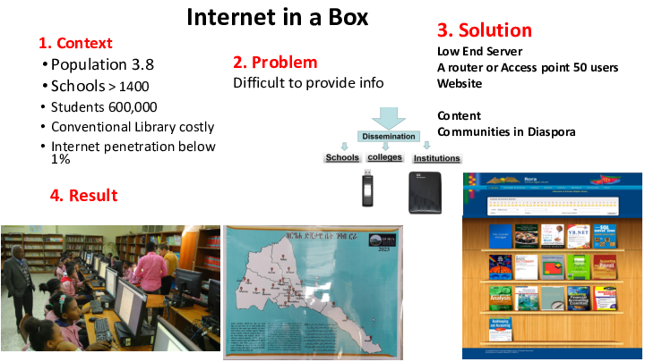
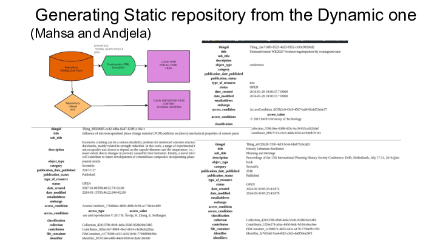
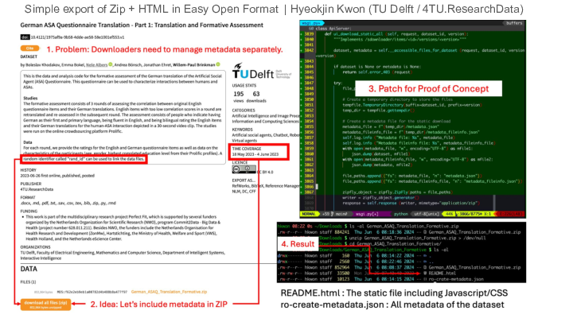

<a href="sss.pdf">PDF version</a> 

    

<section typeof='http://purl.org/ontology/bibo/Slide'>

</section>

<section typeof='http://purl.org/ontology/bibo/Slide'>

Inspired by Prof Hussein Suleman’s closing keynote at OR2023 “Designing Repositories in Poor Countries” this workshop explored practical implementations of Suleman’s principles and goals. We encouraged developers, metadata specialists and managers to embrace, simple and sustainable approaches to making data safe and available using  well established static web  publishing techniques with on-demand indexes and discovery interfaces – contrasting with the complexity of current repository stacks which have grown into bloated enterprise software where setup and data migration are very expensive and hosting requirements are substantial. 

We explored a range of technologies including those mentioned in the keynote and the participants came up with the following ideas which they’ve been working on and documenting throughout the conference.

We’d love to see some of these ideas continue to develop and to show up at OR2025 as poster or dev-track submissions.

</section>

<section typeof='http://purl.org/ontology/bibo/Slide'>

</section>

<section typeof='http://purl.org/ontology/bibo/Slide'>

Easy Open is a [concept / proposal](https://docs.google.com/document/d/1y0Cu5cSia6rlRotnfdU_wcrZUL3DnjXx0MUah--_7-Y/) for a simple, maximally clear, user-friendly top level organization for providing self-contained browsable archives, repositories, datasets etc. which is compatible with the broadest range of existing packaging and metadata standards (but requires none).

The key goal of this proposed standardized top level organization is to make it as clear and easy as possible for a user to begin to consume the contents of a package without having to understand anything about the underlying packaging or metadata solutions used to organize and describe it, while also being compatible with existing and future standards and conventions for providing rich metadata and well organized and portable structure, enabling automated consumption by tools.

Easy Open focuses exclusively on the top level organization of user friendly, easily consumable, browsable, and platform portable content, and is a component of developing recommendations for producing maximally distributable and consumable packages of content, including
operating system and filesystem agnostic
compatible with commonly used web browsers, including text-only and no-javascript environments
Javascript and stylesheets can be used to make the browsing experience more dynamic and richer, but it is recommended that such functionality not be critical to consuming the core content of the package and that users aren't prevented in any significant way from consuming the content without Javascript or stylesheet support
self-contained and consumable offline
minimal run-time resource requirements
all content should be as accessible as possible

See the [draft spec](https://docs.google.com/document/d/1y0Cu5cSia6rlRotnfdU_wcrZUL3DnjXx0MUah--_7-Y/edit).

</section>

<section typeof='http://purl.org/ontology/bibo/Slide'>

Mahsa Eshtehardi: I am a developer and work at the IT department of Chalmers University, where we assist researchers in storing their data. One of their main issues is searching through old records, while our primary concern is security. We prefer to host solutions locally to ensure data protection. I am here to learn more about different technologies related to open repositories. Additionally, I hope to discover new features and address potential concerns that may arise in our implementation.

Anđela Tomić  - I am working at TU Delft as a senior technical developer. My skills and passion date back to the 80s when my first code as a developer was in machine language for the 6510, during which I created some games. This means I have been involved in software development for over 40 years, encompassing various languages, hacking, DIY projects, network design, database design, modelling and administration, smart homes, open hardware, and HAM radio. I am an open source and Linux enthusiast. On my LinkedIn, you will find the following: I came into this world with a screwdriver nestled in my left hand and an incredible, vibrant curiosity. My heart consistently beats to the rhythm of dreams, imagination, mending, advancement, and creation.

Mahsa and Andgela worked on extracting data from a linked-data metadata store at  TU Delft to present a static view of the repository.

</section>

<section typeof='http://purl.org/ontology/bibo/Slide'>

Hyeokjin Kwon (TU Delft / 4TU.ResearchData):  I am a software engineer maintaining https://data.4tu.nl/. One of my goals for our in-house made software is to keep it simple and small. I registered for this session to know if there’s anything I can learn more about.

Worked on adding more information to zip downloads in the repository he works on and is investigating RO-Crate.

</section>

<section typeof='http://purl.org/ontology/bibo/Slide'>

Will Fyson - I’m a software engineer who works for CoSector at the University of London. We support a number of institutional repositories on different platforms, but my experience is primarily with EPrints and I’d be interested to learn more and explore the possibility of turning an EPrints repository into an offline, stand-alone repository, that can potentially be updated again when Web access is available.

John Salter (White Rose Libraries / University of Leeds, UK). Not sure what I’m expecting - happy to have a play with some new tools to help me understand what’s out there, and how they may fit into things I need to do. I’m an EPrints developer/support person (alongside a load of historical cruft I’ve gathered from working in a Library Systems Team / University IT service for too long).

So, it turns out EPrints started work on this topic approximately 4610 days ago.None of us had actually run it. We have now. It still works, and outputs a static browseable site, thumbnails, content.So we broke it whilst trying to make it output a site in the EasyOPEN format previously described.Can output static metadata file in a variety of formats (e.g. DC, JSON)

</section>

<section typeof='http://purl.org/ontology/bibo/Slide'>

You already heard the use case: Eritrea has no reliable Internet, so they rely on physical storage to send and receive Internet content from nearby regions with more reliable Internet. They run research repositories on their local networks, and caching proxy devices to serve some open educational content as if it were ‘online’.

Our tools use projects with large, active communities,  common standards (including new one!), and practical considerations to get local research outputs out onto the Internet in the form of standalone, simple websites, and can also gather useful open resources from the Internet and package it in a way that can is simple to feed into devices like RACHEL Plus or host in local intranet webservers.

We started our prototyping by harvesting OAI-PMH METS feeds from DSpace and EPrints repositories and producing HTML with XSLT as well as markdown frontmatter to feed into more fully-featured site generators like Jekyll, 11ty, Pelican.

</section>

